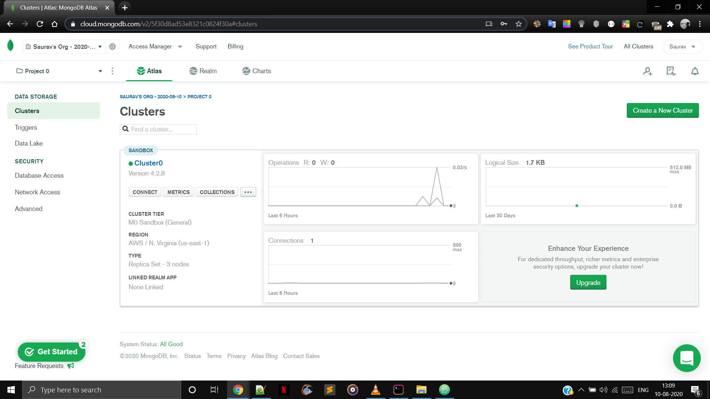
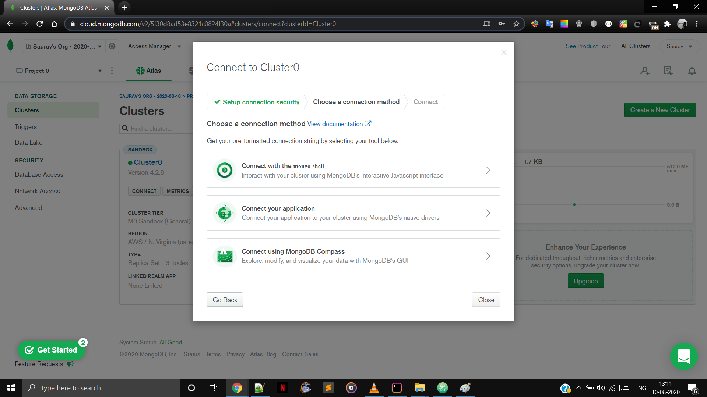

You can get a live view at 

### Pre-Requisites

- Node

  If not downloaded it from here 

### Run

- Download the repository

- Extract it, go to the project folder.

- Open up the terminal.

- Type $ npm i   

- Type node app.js

  Visit  
  

  

### Deploying Web-Apps

Bunch of Data-Base are there but i would recommend to go for MONGO-DB.

Mongo -DB Data base 

Mongo DB own cloud service which is called Atlas. This is going to allow us to have a web based address. Mongo DB Atlas is going to host up the address and serve up the data whenever its needed

​    So, that means our node js app on Heroku will be able to make the necessary request to our database that is hosted on the MongoDB. Atlas cloud services and will be able to delete or update and be able to get data back from that database

#### How to use?

1. Sign Up for MongoDB
2. GO to cloud Section. Choose Atlas 
3. Log in
4. Choose AWS as cloud Provider and Region N.Virginia
5. Choose MO for Cluster Tier
6. Leave rest thing unchanged and create cluster
7. Wait for some minutes
8. Go to Database Access. Click on Add new Database user.
9. Note the credential and select Atlas Admin an user Privileges.
10. Go to Network Access and select .Allow Access from anywhere and select confirm.

 

#### How to connect with your Application?

i. Go to clusters section under Data Storage

ii. Choose connect. A pop-up Appears

   

iii. Click on connect your application

iv. Copy the srv address provided below

v. Go to app.js. replace mongoose.connect address <password> -> Your Password